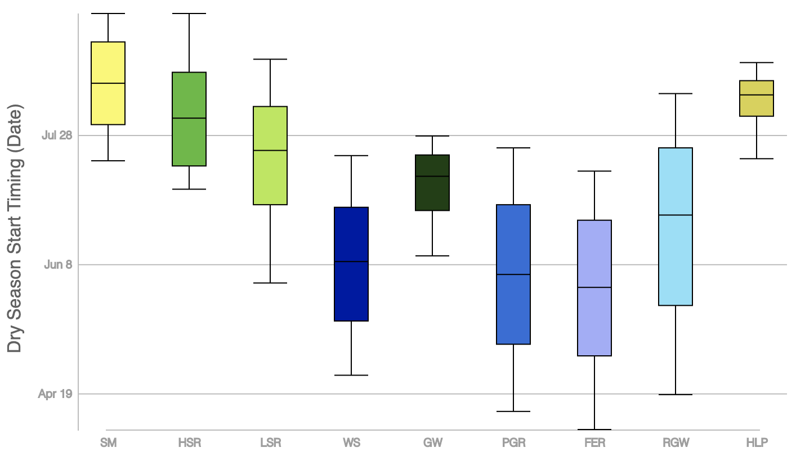

## eFlows Website Purpose

The eFlows Functional Flow Calculator \(FFC\) quantifies key hydrologic aspects of the annual flow regime from any daily streamflow time series. The FFC produces dimensionless reference hydrographs \(defined below\) and a suite of functional flow metrics that quantify functional flow components, referring to portions of the annual flow regime expected to serve distinct geomorphic or ecological functions \([Yarnell et al. 2015](https://academic.oup.com/bioscience/article/65/10/963/245807)\). Results are presented visually and data can be directly downloaded. Users of the FFC can also install and run the FFC on their own computer; for more information see the FFC [installation](../installation.md) section. The hydrographs and metrics enable comparisons of streamflow patterns across regions, natural stream classes, and various forms and magnitudes of flow alteration. The FFC generates 31 metrics describing aspects of streamflow timing, magnitude, duration, frequency, and rate of change, organized into four functional flow components: 1\) wet season initiation flows, 2\) peak magnitude flows, 3\) spring recession flows, and 4\) dry season low flows \(Table 1\).

For more detailed description of how the FFC metrics were calculated, with code snippets, refer to the [online FFC documentation](https://eflow.gitbook.io/ffc-readme/).

[TOC]

# Hydrology

## Stream Classification

California's streams can be organized into nine natural stream classes with distinct flow regime patterns and dominant watershed controls \(Figure 1\). These stream classes represent hydrologic conditions prior to major anthropogenic impacts including dams, diversions, and land use changes \([Lane et al. 2018](https://link.springer.com/article/10.1007/s00267-018-1077-7)\). 223 reference gages with 6 - 65 years of reference data formed the foundation for this effort, spanning a wide range of physiographic settings found in California \([Zimmerman et al. 2017](https://onlinelibrary.wiley.com/doi/full/10.1111/fwb.13058)\).

## Dimensionless Reference Hydrographs

The dimensionless reference hydrographs \(DRHs\) serve as a descriptive visual tool of continuous daily and inter-annual streamflow patterns \([Lane et al. 2018](https://link.springer.com/article/10.1007/s00267-018-1077-7)\). Every natural stream class and reference gage has an associated DRH.

A DRH is calculated by dividing daily streamflow data by the water year's average annual flow. This calculation is performed across all water years of flow data. Then, the 10th, 25th, 50th, 75th, and 90th percentile flows over the entire reference period of record are determined for each date of the water year. These results are then plotted to visualize the range of non-dimensionalized flow that occurs across the water year at a daily time-step. The DRH can represent the period of record for one stream gage, or the results can be aggregated across all reference gages in one stream class to summarize the flow patterns of an entire class. Figure 2 illustrates an example DRH for a snowmelt-dominated stream class.

## Hydrologic Class Boxplots

The metric results from the FFC are aggregated across the reference gages of each hydrologic class, and visualized with class-wide boxplots to allow for comparison (Figure 3). The boxplots display the median (middle line that divides the box into two parts), the interquartile range (75th and 25th percentile values, the top and bottom of the box), and the 90th and 10th percentile values (the "whiskers" extending above and below the box). 

The metrics are also displayed on the class-wide DRHs in a format similar to the boxplots, visualized as colored bands (Figure 4). The values that comprise these bands are the aggregated results across the reference gages of each hydrologic class. Similar to the boxplots, the line in the middle of the band represents the median value, the dark bands on either side are the interquartile range, and the light bands are the 90th and 10th percentile values. 

## Functional Flow Calculator

The functional flow calculator \(FFC\) quantifies key aspects of the annual flow regime  based on long-term daily streamflow time series data, producing a suite of descriptive functional flow metrics. These metrics are meant to characterize ecologically relevant components of any flow regime in a robust, objective manner to enable comparisons of streamflow across regions, natural stream classes, and various forms and magnitudes of flow alteration. The metrics are organized annually by water year, which is the 365 day period over which streamflow is assessed. The FFC uses October 1st - September 30th as the default water year, although this setting can be modified when running user-uploaded data. The FFC generates 34 metrics describing aspects of streamflow timing, magnitude, duration, frequency, and rate of change, organized into five seasonally-based functional flow components: 1\) Fall flush flows, 2\) Wet-season base flows 3\) Peak magnitude flows, 4\) Spring recession flows, and 5\) Dry-season base flows. For more detail about the metrics and how they are calculated, see the Metrics subsection in the Functional Flow Calculator section. For more theory behind the functional flow components, see \([Yarnell et al. 2015](https://academic.oup.com/bioscience/article/65/10/963/245807)\).

## Functional Flow Metrics

The FFC hydrologic metrics are described below. For more detailed description of how these metrics were calculated in the FFC, with code snippets, refer to the [online FFC documentation](https://eflow.gitbook.io/ffc-readme/). 

### Annual Metrics

* **Average annual flow**
  * Arithmetic mean daily flow in each water year.
* **Coefficient of variation**
  * Standard deviation of daily flow divided by arithmetic mean of flow in each water year.

### Fall Flush Flow

This flow component describes the first significant increase in flow following the dry season base flow. The fall flush event often takes the form of a storm event that introduces a pulse of flow into the stream. It typically occurs each year but may not occur in some years depending on climate conditions.

* **Fall flush timing**
  * First date between October 1st and December 15th that flow exceeds the fall flush threshold, which is defined as twice the magnitude of the previous dry season’s base flow or 1 cfs, whichever is greater.
* **Fall flush magnitude**
  * Peak flow magnitude during the flush event.
* **Fall flush duration**
  * Number of days from the start to the peak magnitude of the flush event.

### Wet-Season Base Flow
Wet-season base flow describes the portion of the water year in which wet season precipitation raises base flow levels above levels experienced during the dry summer season. 

* **Wet-season start timing**
  * The date that sufficient baseflow has accrued based on a magnitude threshold of 30% of the difference between baseflow and the peak wet-season flow of the smoothed data.
* **Wet-season baseflow magnitude**
  * 10th and 50th percentile daily flow from the start of the wet-season to the start of the dry season.
* **Wet-season base flow duration**
  * Wet-season baseflow duration (# of days from start of wet season to start of spring season)

### Peak Magnitude Flows

To describe the peak magnitude season, a suite of metrics are calculated for the 10%, 20%, and 50% exeedance values of annual peak flow (10, 5, and 2 year recurrence intervals). Flow may exceed these exceedance values multiple times in some years and not at all in other years.

* **Peak flow magnitude**
  * Peak flow magnitude (10%, 20%, 50% exeedance values of annual peak flow --> 10, 5, and 2 year recurrence intervals)
* **Peak flow duration**
  * Duration of peak flows over wet season (cumulative number of days in which a given peak-flow recurrence interval is exceeded in a year).
* **Peak flow frequency**
  * Frequency of peak flow events over wet season (number of times in which a given peak-flow recurrence interval is exceeded in a year).

### Spring Recession Flows

The spring recession encompasses the seasonal transition from wet season high flows to dry season low flows. Metrics calculated include timing and magnitude of the start of the recession, duration of the recession period, and flow rate of change over that period.

* **Recession start timing**
  * Start date of spring recession is identified four days after the last local peak event following the final major flow period of the wet season. The purpose of delaying the start date by four days is to reduce the influence of individual storm events on the magnitude of the spring recession.
* **Recession start magnitude**
  * Flow magnitude at the start of the spring recession.
* **Recession duration**
  * Number of days of recession period from the spring recession start date to the dry season start date.
* **Recession rate of change**
  * Median daily flow rate of change over the spring recession period, considering only days with negative rates of change.

### Dry Season Base Flow

The dry season base flow period represents the low magnitude, low variability portion of the year between wet seasons.

* **Dry season start timing**
  * Start date of the dry season base flow period is identified based on criteria for relative magnitude, rate of change, and timing. A search window is set from the spring recession start date to the end of the water year \(Sep 30\), and the first date in which: 1) the flow magnitude falls below 12.5% of the wet season’s maximum flow, and 2) rate of change approaches zero, is identified as the start of the dry season.
* **Dry season low flow magnitude**
  * 50th and 90th percentile daily flow from the dry season start date to the wet season start date.
* **Dry season low flow duration**
  * Duration of low flow period, from the dry season start date to the wet season start date.
* **Dry season low flow duration \(\# of no-flow days\)**
  * Number of days that flow magnitude is 0 during the dry season low flow period.

Table 1. Summary of 31 functional flow metrics including the functional flow components they describe, the flow characteristic they quantify, and a brief description.

| **Flow Component**     | **Flow Characteristic**   | **Metric**                                      |
| :--------------------- | :-----------------------: | ----------------------------------------------: |
| Annual                 | Average Annual Flow (cfs) | average flow magnitude across water year        |
|                        | Coefficient of Variation  | standard deviation of flow divided by mean      |
| Fall Flush             | Magnitude (cfs)           | event peak magnitude                            |
|                        | Timing (date)             | event start date                                |
| Wet-Season base flow   | Timing (date)             | start date of wet season                        |
|                        | Magnitude (cfs)           | wet season baseflow magnitude (10th/50th percentile)|
|                        | Duration (days)           | duration                                        |
|  Peak Magnitude Flows  | Magnitude (cfs)           | Event peak magnitude: 10%, 20%, 50%             |
|                        | Duration (days)           | Event duration: 10%, 20%, 50%                   |
|                        | Frequency (#)             | # of events/year: 10%, 20%, 50%                 |
| Spring Recession Flows | Magnitude (cfs)           | magnitude at start of spring                    |
|                        | Rate of change (%)        | median daily flow percent decrease              |
|                        | Timing (date)             | start date of spring                            |
|                        | Duration (days)           | duration                                        |
| Dry Season Base Flow   | Magnitude (cfs)           | baseflow magnitude (50th/90th percentile)       |
|                        | Timing (date)             | start date of dry season                        |
|                        | Duration (days)           | duration from start of dry season until start of wet season|
|                        | Frequency (#)             | # of no-flow days                               |

# Geormorphology

TBD

# Ecology

TBD

